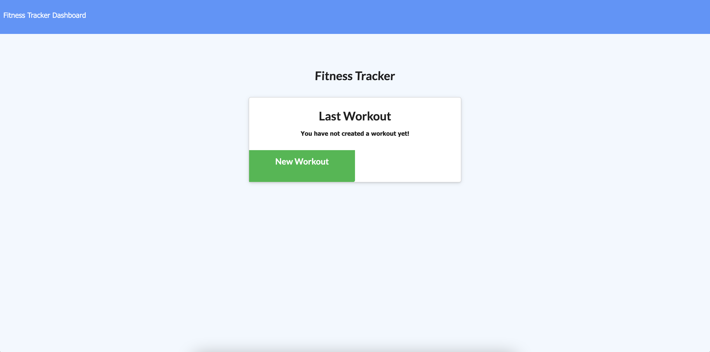
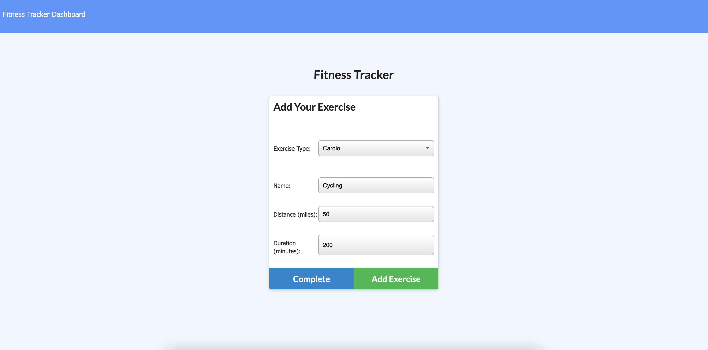
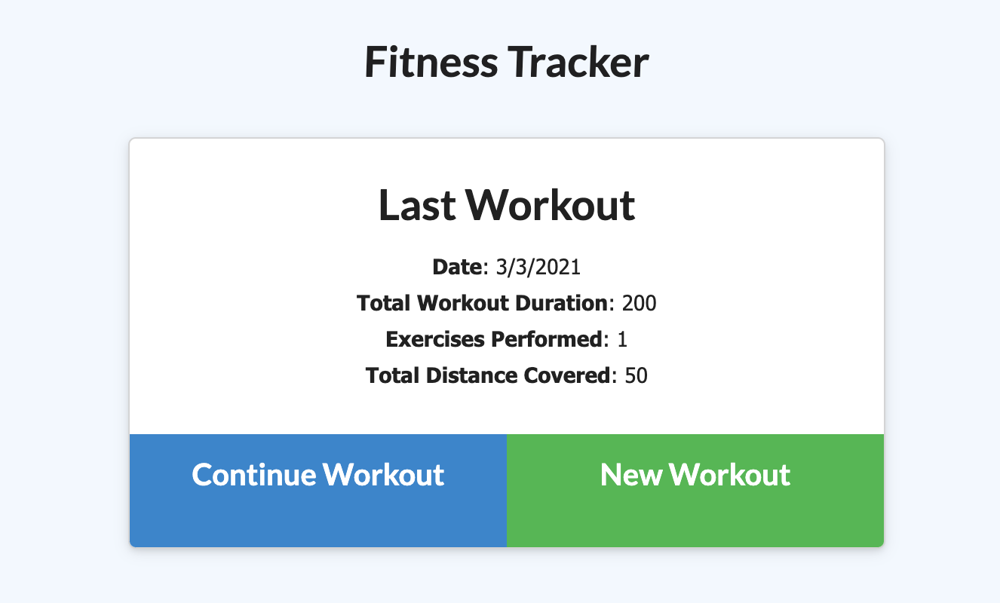
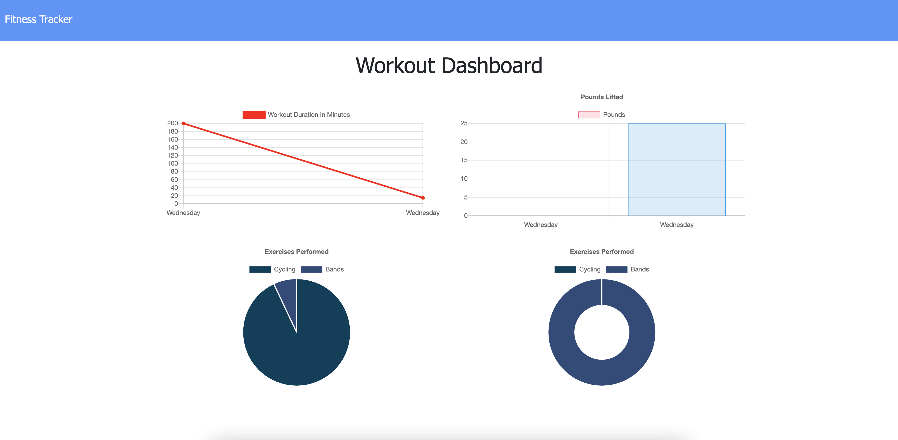

# Workout Tracker

This is an app to track your workout progress. You can choose between resistance or cardio. The information is saved into a Mongo database.

## Live Site

[Click Here](https://safe-everglades-91388.herokuapp.com/)

## Screenshots

First visit to page:

Filling in exercise form:

Updated with most recent workout:

Stats page with recorded workouts:

## Installation

If deploying locally:
* Run `npm install` to get the required node modules
* Run `node server`
* Head to [localhost:3000/](http://localhost:3000/)

Otherwise, no installation needed

## Technologies Used
- HTML
- CSS
- Javascript
- Heroku
- AtlasDB
- MongoDB
- Express

## Questions

For any questions, please contact me at:

**Email:** calebhopkins@outlook.com

**GitHub Profile:** [CalebTheCreative]("https://github.com/CalebTheCreative")